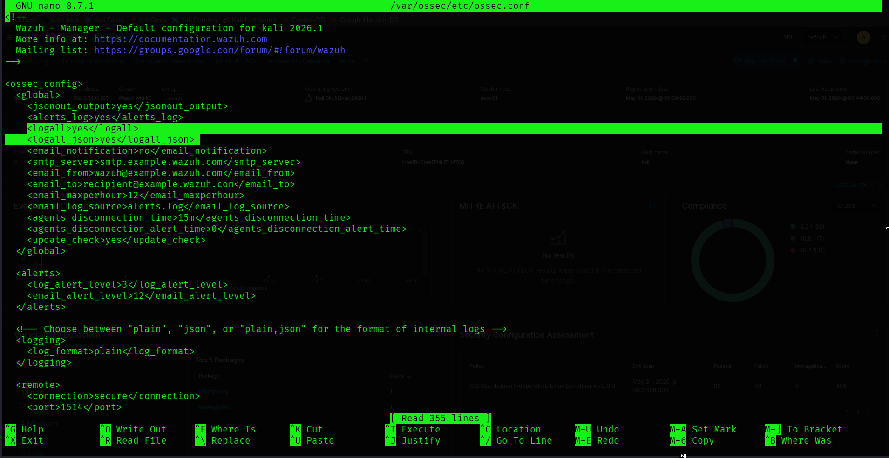
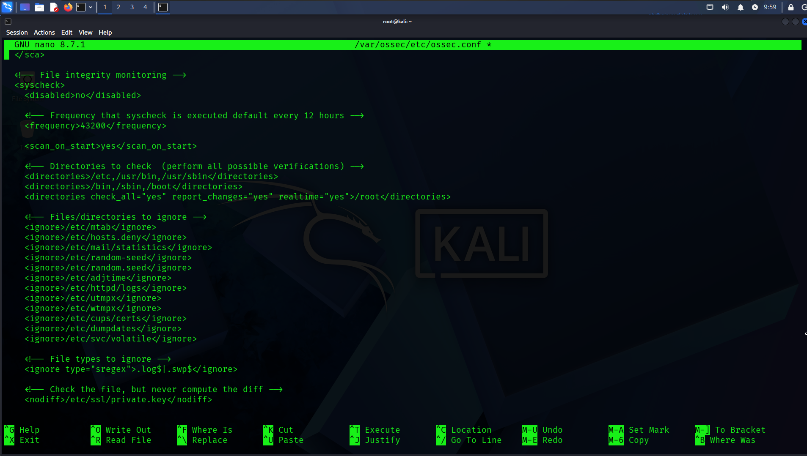
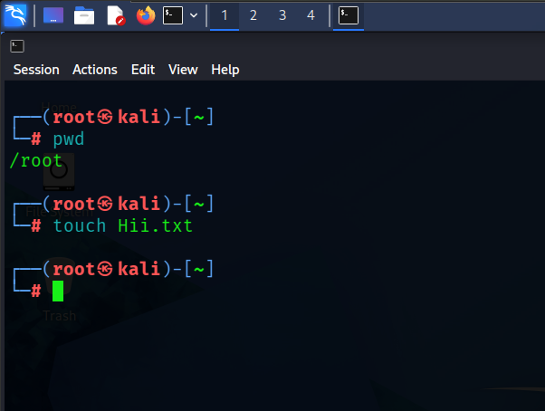
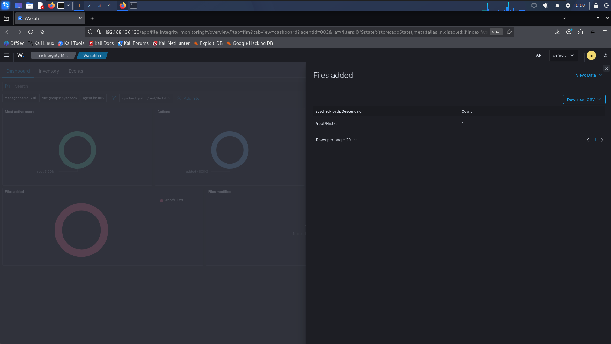

# Wazuh File Integrity Monitoring (FIM) PoC

## Overview

This Proof of Concept (PoC) demonstrates how to configure File Integrity Monitoring (FIM) in Wazuh to detect file creation and modification events on a monitored endpoint.

File Integrity Monitoring helps security teams identify unauthorized changes to critical files and directories. In this PoC, we configure Wazuh to monitor the `/root` directory on a Kali Linux endpoint and generate alerts whenever files are created, modified, or deleted.

---

## Architecture

* **Wazuh Manager** – Collects, stores, and analyzes security events.
* **Wazuh Agent** – Monitors endpoint activities and forwards events to the manager.
* **File Integrity Monitoring (Syscheck)** – Detects file system changes in real time.

---

# Step 1: Enable Full Logging on the Wazuh Manager

On the Wazuh Manager/Server machine, edit the Wazuh configuration file:

```bash
sudo nano /var/ossec/etc/ossec.conf
```

Ensure the following options are enabled:

### PAYLOAD

```xml
<logall>yes</logall>
<logall_json>yes</logall_json>
```

These settings instruct Wazuh to store all collected events in both plain-text and JSON formats. This is useful for troubleshooting, investigations, log analysis, and reviewing detailed security events generated by agents.



---

# Step 2: Configure File Integrity Monitoring on the Agent

On the monitored endpoint (agent), edit the Wazuh configuration file:

```bash
sudo nano /var/ossec/etc/ossec.conf
```

Locate the `<syscheck>` section and ensure FIM is enabled.

### PAYLOAD

```xml
<disabled>no</disabled>
```

This enables the Syscheck module responsible for File Integrity Monitoring.

Next, add the following directory configuration under the directories being monitored:

### PAYLOAD

```xml
<directories check_all="yes" report_changes="yes" realtime="yes">/root</directories>
```

### What does this configuration do?

| Parameter            | Purpose                                                                 |
| -------------------- | ----------------------------------------------------------------------- |
| check_all="yes"      | Monitors permissions, ownership, timestamps, size, and content changes. |
| report_changes="yes" | Captures and reports file content modifications.                        |
| realtime="yes"       | Generates alerts immediately when a change occurs.                      |
| /root                | Directory being monitored.                                              |

This configuration tells Wazuh to continuously watch the `/root` directory and report any detected file system activity in real time.



---

# Step 3: Restart the Wazuh Agent

After saving the configuration, restart the agent so the new settings take effect.

### PAYLOAD

```bash
systemctl restart wazuh-agent
```

Restarting the service reloads the updated configuration and enables monitoring of the newly defined directory.

---

# Step 4: Generate a Test Event

To verify that File Integrity Monitoring is working correctly, create a new file inside the monitored directory.

First, confirm the current working directory:

### PAYLOAD

```bash
pwd
```

Expected output:

```bash
/root
```

Now create a new file:

### PAYLOAD

```bash
touch Hii.txt
```

The `touch` command creates an empty file named `Hii.txt`.

Since `/root` is being monitored by Wazuh in real time, this action should immediately generate a File Integrity Monitoring event and forward it to the Wazuh Manager.



---

# Step 5: Verify the Alert in Wazuh

Navigate to:

```text
Threat Hunting → File Integrity Monitoring
```

You should observe an alert indicating that a new file has been created.

Wazuh records information such as:

* File name
* Event type
* Timestamp
* Monitored directory
* Agent information

This confirms that File Integrity Monitoring is functioning correctly and that Wazuh successfully detected the creation of `Hii.txt`.



---

# Additional Investigation

For more detailed information about monitored files, navigate to:

```text
Inventory → Files
```

The Inventory section provides additional metadata including:

* File paths
* Ownership details
* Permissions
* Hash values
* Modification timestamps
* Historical file information

This information is particularly useful during security investigations, forensic analysis, compliance audits, and incident response activities.

---

# Conclusion

In this PoC, we successfully:

✅ Enabled detailed logging on the Wazuh Manager

✅ Configured File Integrity Monitoring on a Wazuh Agent

✅ Monitored the `/root` directory in real time

✅ Generated a test file creation event

✅ Verified the alert through the Wazuh Dashboard

This PoC demonstrates how Wazuh can detect and alert on unauthorized file system changes, providing an additional layer of visibility and security for monitored endpoints.

---

# Final Thoughts

This PoC demonstrates how Wazuh's File Integrity Monitoring (FIM) can provide real-time visibility into file system activity across monitored endpoints.

Although this example focuses on a simple file creation event within the `/root` directory, the same capability is widely used in production environments to detect unauthorized modifications, suspicious file drops, ransomware activity, configuration tampering, and policy violations.

File Integrity Monitoring plays a critical role in helping security teams maintain visibility into sensitive systems and rapidly identify changes that may indicate compromise or malicious behavior.

A strong understanding of FIM is valuable for anyone pursuing roles in:

* SOC Analysis
* Threat Hunting
* Incident Response
* Detection Engineering
* Security Monitoring
* Blue Team Operations

---

# 👋 Outro

If this walkthrough helped you, feel free to connect with me:

**GitHub:** https://github.com/AdityaBhatt3010

**LinkedIn:** https://www.linkedin.com/in/adityabhatt3010/

**Medium:** https://medium.com/@adityabhatt3010

More writeups soon — cleaner, deeper, and slightly unhinged 🗿🔥

If you found this useful, consider ⭐ starring my repositories and following my cybersecurity journey.
